<div align="center">
  
  
  
  
  

  <br/>

  

  <p>
    <strong>⚡ Control Machines Like You Chat</strong><br/>

  </p>

  <p>
    🛰️ Blend into normal GitHub traffic<br/>
    💬 Turn thoughts into commands<br/>
    ⚙️ Execute anywhere, observe instantly
  </p>

  <p>
    <strong>“No ports. No listeners. Just Issues.”</strong>
  </p>
</div>


---

# neural-C2
---

**neural-C2** is a serverless Command & Control (C2) architecture that uses **GitHub Issues** as a dead-drop relay. It allows you to manage remote machines directly from the **ai Chat** interface using Natural Language (NLP).

---

https://github.com/user-attachments/assets/e99ec34e-ff5e-44a4-86b2-c14fe9ffcb88


---

## 🏗️ How it Works

The system uses a unique "dead-drop" mechanism where no direct socket connection exists between the controller and the agent.

```mermaid
graph LR
    User((USER)) ==>|NLP COMMAND| AI[AI CHAT]
    AI ==>|MCP PROTOCOL| MCP[CONTROLLER]
    MCP ==>|CREATE ISSUE| GH[(GITHUB)]
    GH ==>|POLL| Agent[AGENT]
    Agent ==>|COMMENT| GH
    GH ==>|READ| MCP
    MCP ==>|RESPONSE| AI
    AI ==>|RESULT| User
    
    style User fill:#ff0066,stroke:#ff00cc,stroke-width:4px,color:#fff,font-weight:bold,rx:50,ry:50
    style AI fill:#00ff9d,stroke:#00ff66,stroke-width:4px,color:#000,font-weight:bold,rx:20,ry:20
    style MCP fill:#ffb347,stroke:#ff6600,stroke-width:4px,color:#000,font-weight:bold,rx:20,ry:20
    style GH fill:#bf4dff,stroke:#9b00ff,stroke-width:4px,color:#fff,font-weight:bold,rx:25,ry:25
    style Agent fill:#00ccff,stroke:#0099ff,stroke-width:4px,color:#000,font-weight:bold,rx:20,ry:20
    
    linkStyle default stroke:#ff00ff,stroke-width:3px,fill:none
```



---

1.  **Command**: You tell through ai chat : *"List files on agent-123"*
2.  **Relay**: MCP translates this into a GitHub Issue in your private repository.
3.  **Execution**: The remote agent polls GitHub, sees the task, runs the command, and posts the output as a comment.
4.  **Reporting**: ai reads the comment and explains the result to you.

---

## ✨ Features

-   **Zero Infrastructure**: No port forwarding, no VPS, no complex setup. Just a GitHub account.
-   **Natural Language Control**: Control your infrastructure by chatting. "Is the web server running?" or "Check free disk space."
-   **Multi-Agent Support**: Unique IDs for every machine, with broadcast capability.
-   **Stealthy Relay**: Traffic looks like standard HTTPS calls to `api.github.com`.
-   **Cross-Platform**: Agent runs on Windows (PowerShell) and Linux/macOS (PowerShell Core).

---

## 🛠️ Prerequisites

-   **GitHub Personal Access Token (PAT)**: Requires `repo` permissions.
-   **Python 3.10+** (For the Claude MCP side).
-   **PowerShell 5.1+** (Windows) or **PowerShell Core 7+** (Linux/macOS).
-   **Claude Desktop** installed.

---

## requirements.txt

Create python environment.

```
mcp
requests
```

---

## 🚀 Setup Guide

### 1. GitHub Configuration
1.  Create a **Private Repository** (e.g., `my-c2-relay`).
2.  Generate a GitHub PAT (Personal Access Token) with full `repo` scopes.
    -   *Settings > Developer Settings > Personal Access Tokens > Tokens (classic)*.

### 2. MCP Controller Setup 

Add the server:
```json
{
  "mcpServers": {
    "ai-c2": {
      "command": "your python virtual environment path /bin/python",
      "args": ["/absolute/path/to/ai-c2.py"],
      "env": {
        "GITHUB_TOKEN": "your_token_here",
        "GITHUB_REPO": "your_username/your_repo_name"
      }
    }
  }
}
```
---

### 3. Agent Deployment
1.  Copy `client.ps1` to the target machine.
2.  Configure your **Token** and **Repo** at the top of the file.
```
# ── CONFIGURE THESE ───────────────────────────────────────────────────────────
$GitHubToken = "<github-token>"                                  # Your token
$GitHubRepo  = "githubusername/reponame"                         # Your GitHub repo
```
3.  Run the agent:

```
.\client.ps1
```


---

## 📡 NLP Commands

| Command | Description |
|---|---|
| *"Who is online?"* | Lists all active agents. |
| *"Check IP on agent-456"* | Runs a specific command on a target agent. |
| *"Run 'ls' on everyone"* | Broadcasts a command to all agents. |
| *"Remove dead agents"* | Cleans up agents that haven't checked in recently. |

---


